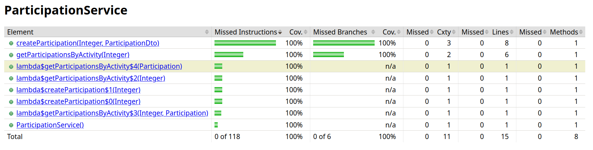

# ES P1 submission, Group 61

## Feature Activity Enrollment

### Subgroup
- Mafalda Matias, 103756, [GitLab link](https://gitlab.rnl.tecnico.ulisboa.pt/ist1103756)
  + Issues assigned: [#1](https://gitlab.rnl.tecnico.ulisboa.pt/es/es24-61/-/issues/1),[#7](https://gitlab.rnl.tecnico.ulisboa.pt/es/es24-61/-/issues/7),[#10](https://gitlab.rnl.tecnico.ulisboa.pt/es/es24-61/-/issues/10),[#34](https://gitlab.rnl.tecnico.ulisboa.pt/es/es24-61/-/issues/34),[#35](https://gitlab.rnl.tecnico.ulisboa.pt/es/es24-61/-/issues/35),[#36](https://gitlab.rnl.tecnico.ulisboa.pt/es/es24-61/-/issues/36),[#37](https://gitlab.rnl.tecnico.ulisboa.pt/es/es24-61/-/issues/37),[#39](https://gitlab.rnl.tecnico.ulisboa.pt/es/es24-61/-/issues/39),[#40](https://gitlab.rnl.tecnico.ulisboa.pt/es/es24-61/-/issues/40),[#43](https://gitlab.rnl.tecnico.ulisboa.pt/es/es24-61/-/issues/43),[#45](https://gitlab.rnl.tecnico.ulisboa.pt/es/es24-61/-/issues/45),[#46](https://gitlab.rnl.tecnico.ulisboa.pt/es/es24-61/-/issues/46)
- Sofia Simas, 103896, [GitLab link](https://gitlab.rnl.tecnico.ulisboa.pt/ist1103896)
  + Issues assigned: [#2](https://gitlab.rnl.tecnico.ulisboa.pt/es/es24-61/-/issues/2),[#12](https://gitlab.rnl.tecnico.ulisboa.pt/es/es24-61/-/issues/12),[#15](https://gitlab.rnl.tecnico.ulisboa.pt/es/es24-61/-/issues/15),[#16](https://gitlab.rnl.tecnico.ulisboa.pt/es/es24-61/-/issues/16),[#33](https://gitlab.rnl.tecnico.ulisboa.pt/es/es24-61/-/issues/33),[#38](https://gitlab.rnl.tecnico.ulisboa.pt/es/es24-61/-/issues/38),[#41](https://gitlab.rnl.tecnico.ulisboa.pt/es/es24-61/-/issues/41),[#42](https://gitlab.rnl.tecnico.ulisboa.pt/es/es24-61/-/issues/42),[#44](https://gitlab.rnl.tecnico.ulisboa.pt/es/es24-61/-/issues/44),[#47](https://gitlab.rnl.tecnico.ulisboa.pt/es/es24-61/-/issues/47), [#48](https://gitlab.rnl.tecnico.ulisboa.pt/es/es24-61/-/issues/48)

### Merge requests associated with this feature

The list of pull requests associated with this feature is:

 -  [MR #7](https://gitlab.rnl.tecnico.ulisboa.pt/es/es24-61/-/merge_requests/7)

 ### Test Coverage Screenshot

---

## Feature Participant Selection

### Subgroup
 - Gonçalo Azevedo, 93075, [GitLab link](https://gitlab.rnl.tecnico.ulisboa.pt/ist193075)
   + Issues assigned: [#3](https://gitlab.rnl.tecnico.ulisboa.pt/es/es24-61/-/issues/3), [#49](https://gitlab.rnl.tecnico.ulisboa.pt/es/es24-61/-/issues/49), [#50](https://gitlab.rnl.tecnico.ulisboa.pt/es/es24-61/-/issues/50), [#54](https://gitlab.rnl.tecnico.ulisboa.pt/es/es24-61/-/issues/54), [#55](https://gitlab.rnl.tecnico.ulisboa.pt/es/es24-61/-/issues/55), [#58](https://gitlab.rnl.tecnico.ulisboa.pt/es/es24-61/-/issues/58), [#59](https://gitlab.rnl.tecnico.ulisboa.pt/es/es24-61/-/issues/59), [#60](https://gitlab.rnl.tecnico.ulisboa.pt/es/es24-61/-/issues/60), [#61](https://gitlab.rnl.tecnico.ulisboa.pt/es/es24-61/-/issues/61), [#62](https://gitlab.rnl.tecnico.ulisboa.pt/es/es24-61/-/issues/62), [#63](https://gitlab.rnl.tecnico.ulisboa.pt/es/es24-61/-/issues/63)
- Diogo Vieira, 99205, [GitLab link](https://gitlab.rnl.tecnico.ulisboa.pt/ist199205)
  + Issues assigned: [#4](https://gitlab.rnl.tecnico.ulisboa.pt/es/es24-61/-/issues/4), [#51](https://gitlab.rnl.tecnico.ulisboa.pt/es/es24-61/-/issues/51), [#52](https://gitlab.rnl.tecnico.ulisboa.pt/es/es24-61/-/issues/52), [#53](https://gitlab.rnl.tecnico.ulisboa.pt/es/es24-61/-/issues/53), [#56](https://gitlab.rnl.tecnico.ulisboa.pt/es/es24-61/-/issues/56), [#57](https://gitlab.rnl.tecnico.ulisboa.pt/es/es24-61/-/issues/57), [#64](https://gitlab.rnl.tecnico.ulisboa.pt/es/es24-61/-/issues/64), [#65](https://gitlab.rnl.tecnico.ulisboa.pt/es/es24-61/-/issues/65), [#66](https://gitlab.rnl.tecnico.ulisboa.pt/es/es24-61/-/issues/66), [#67](https://gitlab.rnl.tecnico.ulisboa.pt/es/es24-61/-/issues/67), [#68](https://gitlab.rnl.tecnico.ulisboa.pt/es/es24-61/-/issues/68), [#69](https://gitlab.rnl.tecnico.ulisboa.pt/es/es24-61/-/issues/69)
 
### Merge requests associated with this feature

The list of pull requests associated with this feature is:

 - [MR #5](https://gitlab.rnl.tecnico.ulisboa.pt/es/es24-61/-/merge_requests/5)

### Test Coverage Screenshot

---

## Feature Institution Assessment

### Subgroup
 - Alice Arnaud Mota, ist1102500, [GitLab link](https://gitlab.rnl.tecnico.ulisboa.pt/ist1102500)
   + Issues assigned: [#6](https://gitlab.rnl.tecnico.ulisboa.pt/es/es24-61/-/issues/6), [#11](https://gitlab.rnl.tecnico.ulisboa.pt/es/es24-61/-/issues/11), [#13](https://gitlab.rnl.tecnico.ulisboa.pt/es/es24-61/-/issues/13), [#14](https://gitlab.rnl.tecnico.ulisboa.pt/es/es24-61/-/issues/14), [#20](https://gitlab.rnl.tecnico.ulisboa.pt/es/es24-61/-/issues/20), [#22](https://gitlab.rnl.tecnico.ulisboa.pt/es/es24-61/-/issues/22), [#25](https://gitlab.rnl.tecnico.ulisboa.pt/es/es24-61/-/issues/25), [#26](https://gitlab.rnl.tecnico.ulisboa.pt/es/es24-61/-/issues/26), [#28](https://gitlab.rnl.tecnico.ulisboa.pt/es/es24-61/-/issues/28), [#31](https://gitlab.rnl.tecnico.ulisboa.pt/es/es24-61/-/issues/31), [#32](https://gitlab.rnl.tecnico.ulisboa.pt/es/es24-61/-/issues/32)
  
 - Ana Margarida Almeida, ist1102618, [GitLab link](https://gitlab.rnl.tecnico.ulisboa.pt/ist1102618)
   + Issues assigned: [#5](https://gitlab.rnl.tecnico.ulisboa.pt/es/es24-61/-/issues/5), [#8](https://gitlab.rnl.tecnico.ulisboa.pt/es/es24-61/-/issues/8), [#9](https://gitlab.rnl.tecnico.ulisboa.pt/es/es24-61/-/issues/9), [#17](https://gitlab.rnl.tecnico.ulisboa.pt/es/es24-61/-/issues/17), [#18](https://gitlab.rnl.tecnico.ulisboa.pt/es/es24-61/-/issues/18), [#19](https://gitlab.rnl.tecnico.ulisboa.pt/es/es24-61/-/issues/19), [#21](https://gitlab.rnl.tecnico.ulisboa.pt/es/es24-61/-/issues/21), [#23](https://gitlab.rnl.tecnico.ulisboa.pt/es/es24-61/-/issues/23), [#24](https://gitlab.rnl.tecnico.ulisboa.pt/es/es24-61/-/issues/24), [#27](https://gitlab.rnl.tecnico.ulisboa.pt/es/es24-61/-/issues/27), [#29](https://gitlab.rnl.tecnico.ulisboa.pt/es/es24-61/-/issues/29), [#30](https://gitlab.rnl.tecnico.ulisboa.pt/es/es24-61/-/issues/30)
 
### Merge requests associated with this feature

The list of pull requests associated with this feature is:

 - [MR #1](https://gitlab.rnl.tecnico.ulisboa.pt/es/es24-61/-/merge_requests/1)
 - [MR #3](https://gitlab.rnl.tecnico.ulisboa.pt/es/es24-61/-/merge_requests/3)
 - [MR #4](https://gitlab.rnl.tecnico.ulisboa.pt/es/es24-61/-/merge_requests/4)
 - [MR #6](https://gitlab.rnl.tecnico.ulisboa.pt/es/es24-61/-/merge_requests/6)

### Test Coverage Screenshot

---

