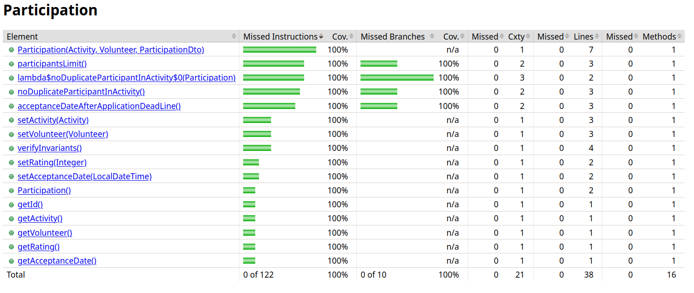
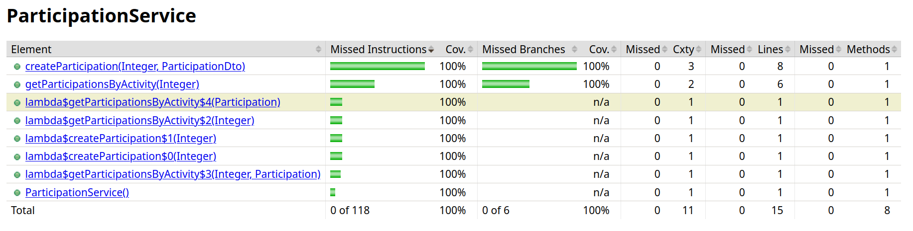

## Feature Participant Selection

### Subgroup
 - Gonçalo Azevedo, 93075, [GitLab link](https://gitlab.rnl.tecnico.ulisboa.pt/ist193075)
   + Issues assigned: [#3](https://gitlab.rnl.tecnico.ulisboa.pt/es/es24-61/-/issues/3), [#49](https://gitlab.rnl.tecnico.ulisboa.pt/es/es24-61/-/issues/49), [#50](https://gitlab.rnl.tecnico.ulisboa.pt/es/es24-61/-/issues/50), [#54](https://gitlab.rnl.tecnico.ulisboa.pt/es/es24-61/-/issues/54), [#55](https://gitlab.rnl.tecnico.ulisboa.pt/es/es24-61/-/issues/55), [#58](https://gitlab.rnl.tecnico.ulisboa.pt/es/es24-61/-/issues/58), [#59](https://gitlab.rnl.tecnico.ulisboa.pt/es/es24-61/-/issues/59), [#60](https://gitlab.rnl.tecnico.ulisboa.pt/es/es24-61/-/issues/60), [#61](https://gitlab.rnl.tecnico.ulisboa.pt/es/es24-61/-/issues/61), [#62](https://gitlab.rnl.tecnico.ulisboa.pt/es/es24-61/-/issues/62), [#63](https://gitlab.rnl.tecnico.ulisboa.pt/es/es24-61/-/issues/63)
- Diogo Vieira, 99205, [GitLab link](https://gitlab.rnl.tecnico.ulisboa.pt/ist199205)
  + Issues assigned: [#4](https://gitlab.rnl.tecnico.ulisboa.pt/es/es24-61/-/issues/4), [#51](https://gitlab.rnl.tecnico.ulisboa.pt/es/es24-61/-/issues/51), [#52](https://gitlab.rnl.tecnico.ulisboa.pt/es/es24-61/-/issues/52), [#53](https://gitlab.rnl.tecnico.ulisboa.pt/es/es24-61/-/issues/53), [#56](https://gitlab.rnl.tecnico.ulisboa.pt/es/es24-61/-/issues/56), [#57](https://gitlab.rnl.tecnico.ulisboa.pt/es/es24-61/-/issues/57), [#64](https://gitlab.rnl.tecnico.ulisboa.pt/es/es24-61/-/issues/64), [#65](https://gitlab.rnl.tecnico.ulisboa.pt/es/es24-61/-/issues/65), [#66](https://gitlab.rnl.tecnico.ulisboa.pt/es/es24-61/-/issues/66), [#67](https://gitlab.rnl.tecnico.ulisboa.pt/es/es24-61/-/issues/67), [#68](https://gitlab.rnl.tecnico.ulisboa.pt/es/es24-61/-/issues/68), [#69](https://gitlab.rnl.tecnico.ulisboa.pt/es/es24-61/-/issues/69)
 
### Merge requests associated with this feature

The list of pull requests associated with this feature is:

 - [MR #5](https://gitlab.rnl.tecnico.ulisboa.pt/es/es24-61/-/merge_requests/5)

### Test Coverage Screenshot

We couldn't work out a way to get Jacoco to give us test coverage for the web services, but we are confident they too have 100% test coverage.

---
